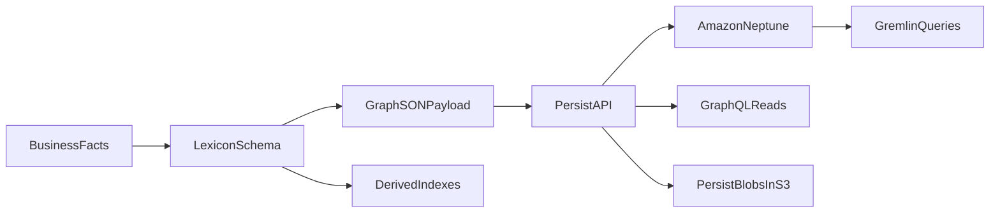

# Two-Week Product And Agent Ramp

This guide turns the two-week ramp plan into a concrete training program for a junior resource with limited software engineering and AWS experience. It is designed for someone who needs to become useful on SOCAPITAL products and agents through supervised, hands-on work.

The goal is not to produce an independent senior engineer in ten days. The goal is to produce someone who can read our repositories, understand the shape of our AWS services, make small changes with review, use the team kit correctly, and explain failure modes before touching production paths.

## Operating Model

Each day has four parts:

- Guided walkthrough: 45-60 minutes with a senior engineer or recorded reference.
- Hands-on problem: 90-120 minutes of focused work.
- Review: 30 minutes to inspect the deliverable and reasoning.
- Quiz: 15 minutes written or verbal.

The learner should keep a daily journal with:

- What they changed or designed.
- What they did not understand.
- Which AWS services were involved.
- Which tests or validation steps they would run.
- What they would ask before implementing in a real product.

Use the same core standards throughout the ramp:

- TypeScript for services, APIs, Lambdas, CDK, and agents.
- Python only for PySpark and AWS Glue jobs.
- AWS-first design in `us-east-2`.
- CDK for all infrastructure.
- Vitest or Pytest for tests.
- Structured logs, metrics, CloudWatch, X-Ray, and critical failure alerting for operational paths.
- Lambda-hosted agents with Chat SDK, DynamoDB state, Bedrock through Vercel AI SDK, LangSmith traces, and AgentCore Memory where agent conversation history is needed.

## How The Learner Uses The Kit During Training

The learner should use the team kit as a coach, navigator, and reviewer. The kit can explain patterns, route them to the right specialist, review their draft, and quiz them. It should not replace the learner's first attempt.

### Daily Agent Workflow

Use this workflow each training day:

1. Start with `/arceus` when unsure which specialist or skill applies.
2. Ask for coaching, not a finished answer.
3. Let the learner write the first draft.
4. Ask the agent to review the draft against the day's checklist.
5. Ask the agent to quiz the learner.
6. Save the learner's final answer and missed concepts in the daily journal.

Use this prompt pattern:

```text
/arceus I am on Day <number> of the two-week product and agent ramp: <day title>.
Coach me through today's exercise. Do not give me the full answer first.
Ask me questions, make me produce the deliverable, review my answer against the checklist, and quiz me at the end.
```

For example:

```text
/arceus I am on Day 2 of the two-week product and agent ramp: TypeScript Service Design.
Coach me through designing a typed Lambda handler contract for registering a report request.
Do not give me the full answer first. Ask me for my schema, handler pseudocode, domain function, error shapes, and tests.
Then review my answer and quiz me at the end.
```

### Agent Routing Cheat Sheet

Use these specialists when the daily exercise starts to look like a real product pattern:

- `/arceus`: always start here when the learner is unsure which path to take.
- `/ash`: AI or Asana-triggered agents.
- `/metagross`: fullstack frontend/backend systems with APIs and Lambda.
- `/machamp`: batch workflows, ETL, Step Functions, Glue, or large file processing.
- `/alakazam` or `/espeon`: RAG, embeddings, OpenSearch, or knowledge agents.
- `/conkeldurr`: platform product architecture and product-boundary questions.
- `/porygon`: metric definitions, metric reconciliation, or dashboard metric questions.
- `/xatu`, `/chatot`, and `/oranguru`: communication audience, activity lifecycle, and channel runtime work.

Also install and use `soc-team-kit` when the work touches SOCAPITAL-only systems:

- `soc-team-kit` provides SOCAPITAL-specific agents and skills for Lexicon, Persist, Interprose, transactional DB access, settlement/offers, media requests, mail campaigns, PagerDuty, and portal smoke testing.
- Use `/unown` for Lexicon curation and schema changes.
- Use `so-persist-product` guidance for Persist integration, GraphSON, Gremlin, Neptune, Persist blobs, and EventBridge graph facts.
- Use SOC skills when a task references internal secrets, internal AWS accounts, Interprose, Persist, Lexicon, or transactional databases.

If a specialist gives too much of the answer, the learner should redirect:

```text
Pause. Do not solve it for me yet. Ask me the next question I should answer and wait for my draft.
```

### What Good Agent Use Looks Like

Good use:

- The learner asks the agent to explain unfamiliar terms.
- The learner asks which files to inspect next.
- The learner writes a draft and asks for review.
- The learner asks the agent to quiz them.
- The learner asks what assumptions are unsafe.

Bad use:

- Asking the agent to generate the whole solution before trying.
- Copying code without explaining it.
- Letting the agent choose AWS services without asking why.
- Skipping tests, validation, or failure-mode discussion.
- Treating an agent answer as correct without checking repo guidance.

## SOCAPITAL Product Repositories To Practice On

Use real Spring Oaks repositories during the ramp. The learner should not try to deeply master every repo in two weeks. They should learn how to recognize each product's purpose, runtime shape, AWS services, entrypoints, validation commands, and safety rules.

### Product Map

| Repo | What It Teaches | Runtime Shape | Key Navigation Targets |
| --- | --- | --- | --- |
| `soc-team-kit` | SOCAPITAL-only agents and skills, internal guardrails, Lexicon/Persist/Interprose operating knowledge | Cursor plugin with agents and skills | `README.md`, `agents/`, `skills/`, `AGENTS.md` |
| `persist` | Graph persistence API, Neptune, GraphSON, Gremlin, IAM-authenticated APIs, async reads/ingest | CDK + API Gateway + Lambda + Neptune + S3 blobs + Step Functions/EventBridge paths | `README.md`, `lib/persist-stack.ts`, `lambda/`, `test/`, GraphSON docs |
| `lexicon` | Canonical graph schema, vertices, edges, indexes, rulesets, transform mappings, schema UI | Vite/React UI + schema data + CDK publishing path | `src/data/lexicon.json`, `src/data/rulesets/`, `src/transform/`, `infra/`, tests |
| `sms-workflow` | End-to-end SMS runtime, filter-to-solver-to-render-to-send lifecycle, campaign and single-debt modes | Step Functions + Glue solver + Lambda workers + SQS + EventBridge + S3 + Persist | `README.md`, `glue_solver/`, `sender/`, `feedback/`, `template-sync/`, `cdk/`, `docs/contracts/` |
| `filter` | Eligibility filtering, graph reads, S3 input/output, Step Functions orchestration, opt-in eligibility ingest | TypeScript Lambda + Step Functions + CDK + S3 + Neptune/Persist integration + EventBridge | `AGENTS.md`, `lib/filter-stack.ts`, Lambda source, tests, S3 input/output contracts |
| `solver` | Scheduling optimization, Spark prep, OR-Tools assignment, Glue runtime, capacity constraints | Step Functions + Distributed Map + Lambda enrichment + Glue PySpark + OR-Tools + S3 outputs | `glue_job/solver_glue_job.py`, `src/or_solver.py`, `cdk/solver_cdk/solver_stack.py`, workflow input/output docs |
| `transform` | Table-to-graph transform, cost gating, Glue PySpark, mapping SQL, Neptune bulk-load CSV outputs | TypeScript CDK + Lambda cost/metrics + Step Functions + Glue PySpark + S3 outputs | `bin/`, `lib/`, `src/lambdas/`, `src/shared/`, `glue_scripts/`, `docs/`, `test/` |

### Suggested Repository Rotation

Use this rotation so the learner sees the same architecture concepts in real code:

- Day 1: map `soc-team-kit` first, then map one product repo such as `persist` or `filter`.
- Day 2: use `filter` or `persist` to study TypeScript Lambda boundaries and typed validation.
- Day 3: use `persist` for API contracts and product boundaries.
- Day 4: use `lexicon` plus `persist` to understand schema ownership, GraphSON, S3 blobs, SSM, Secrets Manager, and durable graph state.
- Day 5: use `sms-workflow`, `filter`, `solver`, and `transform` to compare Step Functions, SQS, EventBridge, Glue, and S3 output contracts.
- Day 6: use CDK stacks from `persist`, `filter`, `sms-workflow`, or `transform` to practice reading infrastructure.
- Day 7: use `persist` and `filter` to practice logs, metrics, X-Ray, DLQs, PagerDuty paths, and production safety.
- Day 8: use `soofi-xyz-team-kit` and `soc-team-kit` to understand agent/plugin boundaries, then design an Asana-triggered agent.
- Day 9: compare all product patterns and route each example to the right kit agent or skill.
- Day 10: use the capstone to combine agent, product API, state, observability, and AWS reasoning.

### Product Navigation Worksheet

For every repo in the rotation, the learner should answer:

```text
Repository:
Business purpose:
Primary runtime:
Primary AWS services:
Language/runtime:
Package manager:
Main application entrypoint:
Infrastructure entrypoint:
Input contract:
Output contract:
State owned by this repo:
External products it depends on:
Validation commands:
Deployment path:
Most important safety rule:
Which team kit agent or skill should help:
Questions I still have:
```

### Product-Specific Coaching Prompts

Use these prompts when practicing on real product repos:

```text
/arceus I am training on the SOCAPITAL product repo <repo-name>.
Coach me through mapping its business purpose, runtime shape, AWS services, source entrypoints, CDK entrypoints, validation commands, input/output contracts, state ownership, and safety rules.
Do not summarize the repo for me first. Ask me to inspect files and propose answers, then review my repo map.
```

For `soc-team-kit`:

```text
/arceus I am training on soc-team-kit.
Coach me through understanding which SOCAPITAL-only agents and skills exist, when to use them, and how they complement soofi-xyz-team-kit.
Make me identify when work should use /unown, so-persist-product, integrating-interprose, transactional-db-access, or PagerDuty guidance.
```

For `persist`:

```text
/arceus I am training on Persist.
Coach me through the graph persistence API. Make me explain /persist/ingest, /persist/validate, /persist/gremlin, /persist/gremlin-async, GraphSON, Neptune, Persist blobs, IAM auth, tests, and CDK infrastructure.
Review my answers and quiz me.
```

For `lexicon`:

```text
/arceus I am training on Lexicon.
Coach me through the schema model. Make me explain vertices, edges, indexes, rulesets, transform SQL, overlay behavior, validation tests, and why Persist depends on deployed Lexicon.
If I discuss schema changes, route me to /unown.
```

For `sms-workflow`:

```text
/arceus I am training on sms-workflow.
Coach me through the end-to-end runtime from campaign intake to filter, solver, render, send, feedback, Interprose export, and Persist campaign membership.
Make me identify each Step Functions workflow, Glue job, SQS queue, S3 contract, and safety rule.
```

For `filter`:

```text
/arceus I am training on filter.
Coach me through the service that reads debt inputs from S3, queries graph data, applies eligibility rules, writes S3 outputs, and optionally emits eligibility ingest events.
Make me explain why eligibility ingest is opt-in and why production hot patches are forbidden.
```

For `solver`:

```text
/arceus I am training on solver.
Coach me through the Step Functions plus Glue PySpark plus OR-Tools architecture.
Make me explain input S3 prefixes, enrichment, phone selection, capacity prefiltering, min-cost-flow assignment, output S3 partitions, run summaries, and CloudWatch metrics.
```

For `transform`:

```text
/arceus I am training on transform.
Coach me through the table-to-graph transform pipeline.
Make me explain Step Functions, cost estimation, manual cost approval, Glue PySpark mappings, Lexicon SQL mapping URIs, Neptune bulk-load CSV outputs, quality gates, and metrics.
```

## Lexicon, Persist, Neptune Deep Dive

This module teaches the graph data layer that many SOCAPITAL products depend on. It can run as a two-day deep dive inside the 10-day ramp or as a standalone four-session module for someone who needs more graph-data readiness.

Use these references while coaching:

- `lexicon/README.md`: Lexicon schema, overlays, vertex indexes, tests, and quality gates.
- `persist/README.md`: Persist endpoints, GraphSON, Neptune config, local Gremlin tests, transactions, blobs, and CI.
- `soc-team-kit/README.md`: SOC-specific agents and skills for `exploring-lexicon`, `updating-lexicon`, `/unown`, and `so-persist-product`.

### Mental Model



Teach this sequence:

- A graph database stores entities as vertices and relationships as edges.
- Amazon Neptune is AWS's managed graph database.
- Gremlin is the traversal language used to move through graph relationships.
- Lexicon is the governed schema: allowed vertices, edges, properties, enums, indexes, and required fields.
- Persist is the API layer that validates data against Lexicon and safely writes or reads graph facts.
- GraphSON is the typed payload format Persist accepts for graph writes.

### Module 1: What Is A Graph Database?

Teach:

- Vertices are durable entities such as `person`, `debt`, `address`, `company`, `document`, or `campaign`.
- Edges are relationships or events such as a person owing a debt, a debt having a balance, or a debt status changing.
- Properties are typed facts stored on vertices or edges.
- Traversal means moving through relationships rather than joining tables.
- Graphs fit SOCAPITAL because debts, people, phones, addresses, sellers, accounts, interactions, documents, campaigns, and statuses are naturally connected.

Hands-on problem:

```text
Draw a small graph for person -> debt -> balance -> status.
Identify which items are vertices, which facts should be edges, and which fields are properties.
Explain one question that is easier in graph form than in flat tables.
```

Review checklist:

- Separates entities from relationships.
- Uses edges for historical relationship or event facts.
- Does not put every changing status directly on a durable vertex.
- Can explain why graph traversal helps answer relationship questions.

Quiz:

1. What is a vertex?
2. What is an edge?
3. What is a graph traversal?
4. How is a graph different from a relational join model?
5. Why do historical facts often become edges rather than mutable fields?

Answer key:

1. A vertex is an entity in the graph, such as a person or debt.
2. An edge is a relationship or event connecting vertices.
3. A traversal is a query path through vertices, edges, labels, and properties.
4. A graph stores relationships as first-class data; relational systems reconstruct relationships through joins.
5. Edges preserve history and allow current state to be derived without overwriting prior facts.

### Module 2: What Is Lexicon?

Teach from `lexicon`:

- `src/data/lexicon.json` is the graph schema source of truth.
- `vertices[]` defines allowed vertex labels, properties, required fields, enums, and indexes.
- `edges[]` defines allowed relationship labels, direction, properties, required fields, and indexes.
- `common_patterns` defines shared formats.
- Indexes are derived current-state fields maintained for faster reads, not arbitrary ingest properties.
- Base + overlay behavior allows multiple parties to write one shared graph while preserving ownership.
- Persist validates writes against the deployed Lexicon, not whatever the local branch happens to contain.

Hands-on problem:

```text
Inspect src/data/lexicon.json.
Pick one vertex and list its properties, required fields, enum fields, and indexes.
Pick one edge and explain from, to, required properties, and business meaning.
Explain why Persist rejects a write that does not conform to the deployed Lexicon.
```

Review checklist:

- Finds the correct vertex and edge definitions.
- Understands edge direction through `from` and `to`.
- Differentiates properties from derived indexes.
- Checks `required`, `enum`, `format`, and `pattern` rules.
- Knows to use `/unown` and `updating-lexicon` for schema changes.

Quiz:

1. What does Lexicon control?
2. What is the difference between a property and an index?
3. Why does edge direction matter?
4. What does `required` mean?
5. Why should schema changes use `/unown`?

Answer key:

1. Lexicon controls allowed graph labels, properties, required fields, types, enums, formats, relationships, and derived indexes.
2. A property is a fact stored directly on a vertex or edge; an index is a derived current-state projection maintained from graph changes.
3. Direction defines the source and target labels for a relationship and determines traversal shape.
4. Required fields must be present for valid graph facts of that label.
5. `/unown` guards schema modeling decisions, immutability rules, validation, and review risk.

### Module 3: What Is Persist?

Teach from `persist`:

- Persist is a serverless API over Amazon Neptune.
- It exposes `/persist/validate`, `/persist/ingest`, `/persist/ingest-async`, `/persist/gremlin`, `/persist/gremlin-async`, and GraphQL read surfaces.
- It uses IAM/SigV4 authorization.
- It validates writes against Lexicon before persisting them.
- It supports GraphSON v3, sync-only vertex references, Persist blobs, async ingest, bulk CSV workflows, and EventBridge graph facts.
- Local tests use a Gremlin server so traversal behavior stays close to production.

Hands-on problem:

```text
Map each Persist endpoint to a use case.
For a sample graph fact, decide whether to call validate, ingest, ingest-async, gremlin, gremlin-async, or GraphQL.
List the AWS resources involved: API Gateway, Lambda, Neptune, S3 blob bucket, Step Functions/EventBridge paths, CloudWatch, and IAM.
```

Review checklist:

- Uses `/persist/validate` before writes when designing a payload.
- Uses `/persist/ingest` for sync GraphSON writes.
- Uses `/persist/gremlin` or GraphQL only for read paths.
- Understands IAM/SigV4 as the API auth model.
- Identifies S3 blob storage for blob-typed Lexicon properties.

Quiz:

1. What is `/persist/validate` for?
2. When would you use `/persist/ingest`?
3. Why are Gremlin endpoints read-only for consumers?
4. What is IAM/SigV4 doing?
5. What is a Persist blob?

Answer key:

1. It dry-runs Lexicon and GraphSON validation without persisting data.
2. Use it for synchronous GraphSON writes of vertices, vertex references, and edges.
3. Consumers should not mutate graph state through arbitrary traversals because writes must be governed and validated.
4. IAM/SigV4 authenticates and authorizes AWS callers to invoke the Persist API.
5. A Persist blob stores large/raw content in S3 while the graph stores the resulting S3 URI.

### Module 4: Neptune And Gremlin Basics

Teach:

- Neptune is AWS managed graph storage.
- Gremlin is a traversal language: start from vertices or edges, filter by labels/properties, traverse relationships, and project results.
- Persist protects consumers from direct Neptune access by exposing validated APIs.
- Production uses a SigV4-signed Neptune connection; tests use a local Gremlin server.
- Query safety matters: use Lexicon labels and business identifiers, avoid internal element IDs in business reports, and keep traversals bounded.

Hands-on problem:

```text
Translate these plain-English questions into traversal shapes without running production queries:
1. Find a debt by business identifier.
2. Traverse from debt to related person.
3. Read latest debt status through a derived index.
4. Count records by a Lexicon-defined enum.
```

Review checklist:

- Starts from a bounded root when possible.
- Uses Lexicon-defined labels and properties.
- Avoids graph-internal IDs for business logic.
- Can explain when async Gremlin is safer than a sync query.
- Can explain why local Gremlin tests matter.

Quiz:

1. What is Neptune?
2. What is Gremlin?
3. Why should business queries use Lexicon business identifiers instead of internal element IDs?
4. What makes an unbounded graph traversal risky?
5. Why do tests use a local Gremlin server?

Answer key:

1. Neptune is AWS's managed graph database service.
2. Gremlin is a graph traversal/query language.
3. Business identifiers are stable and meaningful; internal graph IDs are implementation details and unsafe for reports or contracts.
4. It can scan too much graph data, time out, cost too much, or produce hard-to-verify results.
5. Tests exercise real traversal behavior closer to Neptune than pure mocks.

### Module 5: GraphSON And Lexicon-Compliant Ingest

Teach:

- GraphSON v3 wraps typed graph values using `@type` and `@value`.
- Vertex and edge payloads must include typed IDs, labels, and properties.
- Lexicon `integer`, `number`, `string`, and `boolean` map to GraphSON types or primitives.
- `vertexRefs` connect edges to existing canonical vertices in sync ingest.
- Async ingest has different constraints, including no `vertexRefs`.
- Common validation failures include unknown labels, missing required properties, invalid enum values, wrong edge direction, malformed typed IDs, and non-S3 values for blob properties.

Hands-on problem:

```text
Given a Lexicon vertex and edge, draft a small GraphSON payload.
Dry-run validation by checking label exists, properties exist, required fields are present, enums are valid, types are valid, and edge direction is correct.
Decide whether to use vertexRefs or resend vertices.
```

Review checklist:

- Uses valid Lexicon labels.
- Uses required properties.
- Uses GraphSON typed values where required.
- Correctly identifies edge `outV` and `inV`.
- Explains when `vertexRefs` are valid and when async ingest cannot use them.

Quiz:

1. What is GraphSON?
2. Why does Persist require typed IDs?
3. What is a vertex reference?
4. Why validate before ingest?
5. What common mistakes cause Persist validation errors?

Answer key:

1. GraphSON is a JSON representation of graph data with typed graph values.
2. Typed IDs keep graph identity unambiguous and compatible with Gremlin/Neptune behavior.
3. A vertex reference points an edge to an existing canonical vertex without resending the vertex.
4. Validation catches schema and payload errors before mutating graph state.
5. Unknown labels, missing required fields, wrong types, invalid enums, wrong edge direction, malformed IDs, and invalid blob values.

### Module 6: Safe Schema And Product Changes

Teach:

- Lexicon changes affect every producer and consumer of the graph.
- New vertices, edges, properties, enums, and indexes require careful review.
- Persist validates against deployed Lexicon, so producers must not write facts before the schema is released to the target environment.
- Derived indexes need a trigger, subject query, and value query.
- Use `/unown` and `updating-lexicon` for schema decisions.
- Use `so-persist-product` for ingest, query, IAM, GraphSON, and EventBridge integration.

Hands-on problem:

```text
Given a product request, decide whether it requires a new vertex, new edge, new property, new derived index, or no schema change.
Write the review questions before implementation.
```

Review checklist:

- Considers whether the fact is an entity, relationship, event, or current-state projection.
- Does not mutate durable historical facts casually.
- Checks existing Lexicon before inventing labels.
- Identifies producer and consumer impact.
- Names the release dependency before producers write new graph facts.

Quiz:

1. Why are schema changes higher risk than normal code changes?
2. What is a derived index change trigger?
3. What must be true before a producer writes a new graph fact?
4. Which agent or skill should help with Lexicon curation?
5. Which skill should help with Persist integration?

Answer key:

1. Schema changes affect all graph writers, readers, validations, reports, and downstream products.
2. It identifies which inserted or changed graph element should recompute the index.
3. The target environment's deployed Lexicon must recognize the labels and properties being written.
4. `/unown` and `updating-lexicon`.
5. `so-persist-product`.

### Graph Data Capstone

Prompt:

```text
Design how to store and query a new graph fact: a debt received a seller media request requirement.
Explain the graph model, candidate Lexicon labels/properties, whether a new vertex or edge is needed, the Persist endpoint path, GraphSON validation steps, Neptune/Gremlin read path, AWS permissions, tests, and operational risks.
Do not write production code. Produce an architecture and safety review.
```

Expected deliverable:

- Plain-English graph model.
- Vertex, edge, property, or index decision.
- Lexicon lookup checklist.
- Persist API selection.
- GraphSON payload sketch.
- Query or read plan.
- IAM and AWS resources involved.
- Tests and validation.
- Safety concerns and review questions.

Review checklist:

- Explains the business fact before choosing a schema shape.
- Checks existing Lexicon labels first.
- Distinguishes durable entities, relationships, event facts, and derived current state.
- Chooses the Persist endpoint deliberately.
- Validates GraphSON before ingest.
- Uses business identifiers in read/query plans.
- Names IAM, SSM, CloudWatch, and deployment dependencies.
- Identifies PII, secret, and production safety risks.

Scoring rubric:

- Beginner: can define vertex, edge, property, and knows Lexicon exists.
- Guided: can inspect `lexicon.json`, explain Persist endpoints, and identify basic validation failures with help.
- Pairing ready: can model a simple graph fact, choose Persist endpoints, explain GraphSON basics, and name safety risks.
- Junior ready: can propose a small Lexicon/Persist integration plan with correct schema, validation, IAM, query, test, and operational reasoning under review.

Suggested learner prompt:

```text
/arceus I am doing the Lexicon and Persist deep dive.
Coach me through what a graph database is, what Neptune does, what Lexicon controls, and how Persist validates and stores graph data.
Do not give me all answers first. Ask me to inspect the Lexicon and Persist docs, explain vertices/edges/properties, design a small graph model, then quiz me.
```

### Day-Start Prompts

Day 1:

```text
/arceus I am on Day 1: Engineering Basics And Repo Navigation.
Coach me through mapping this repository. Do not give me the full answer first.
Ask me to find the package manager, source directories, tests, validation commands, infrastructure, important docs, and change lifecycle.
Review my repo map and quiz me at the end.
```

Day 2:

```text
/arceus I am on Day 2: TypeScript Service Design.
Coach me through designing a typed Lambda handler contract. Do not write the full solution first.
Make me define the schema, request type, handler pseudocode, domain function, validation errors, and tests.
Review my draft and quiz me at the end.
```

Day 3:

```text
/arceus I am on Day 3: APIs And Product Boundaries.
Coach me through sketching an API contract. Do not solve it first.
Make me define request and response shapes, errors, idempotency, permissions, and AWS resources.
Review my API and quiz me at the end.
```

Day 4:

```text
/arceus I am on Day 4: Persistence, Graph Data, Lexicon, And Persist.
Coach me through what a graph database is, what Neptune does, what Lexicon controls, and how Persist validates and stores graph data.
Make me inspect Lexicon and Persist, design a small graph model, choose storage for related files/secrets/config, and quiz me at the end.
```

Day 5:

```text
/arceus I am on Day 5: Queues, Events, And Async Workflows.
Coach me through designing an async workflow for 1,000 items with retries, DLQs, idempotency, status, and metrics.
Do not give me the workflow first. Review my design and quiz me.
```

Day 6:

```text
/arceus I am on Day 6: Infrastructure As Code With CDK.
Coach me through reading a CDK stack. Ask me to identify resources, permissions, environment variables, outputs, risks, and one safe improvement.
Review my explanation and quiz me.
```

Day 7:

```text
/arceus I am on Day 7: Observability And Production Debugging.
Coach me through a missing-rows incident. Make me identify logs, metrics, traces, alarms, status records, hypotheses, and one observability improvement.
Review my debugging plan and quiz me.
```

Day 8:

```text
/arceus I am on Day 8: AI Agent Architecture.
Coach me through designing a small Asana-triggered agent. Do not write the design first.
Make me define trigger, input contract, tools, AWS resources, state, memory, observability, and test plan.
Review my architecture and quiz me.
```

Day 9:

```text
/arceus I am on Day 9: Product Patterns In This Ecosystem.
Coach me through routing three product asks to the right implementation pattern, AWS services, and team kit specialist.
Make me ask clarifying questions and name risks before reviewing my answer.
Quiz me at the end.
```

Day 10:

```text
/arceus I am on Day 10: Capstone And Readiness Review.
Coach me through the export-status agent capstone. Do not produce the architecture for me.
Make me write the one-page plan, contracts, AWS resource list, IAM summary, state and memory decision, tests, observability, risks, and implementation steps.
Review me against the final rubric and quiz me.
```

### Optional Lexicon/Persist Deep-Dive Prompts

Use these when the mentor wants extra graph-data practice during the daily ramp.

Day 4 graph modeling:

```text
/arceus I am doing the Day 4 Lexicon/Persist deep dive.
Make me explain vertices, edges, properties, Neptune, Gremlin, Lexicon, Persist, GraphSON, and validation.
Then make me model a simple person-debt-balance graph fact and review my answer.
```

Day 7 graph debugging:

```text
/arceus I am doing Day 7 debugging with Persist and Neptune.
Coach me through a failed graph ingest or missing graph read. Make me identify Lexicon validation errors, Persist response envelopes, CloudWatch logs, Gremlin query risks, metrics, and what evidence proves the failure point.
```

Day 9 product routing:

```text
/arceus I am doing Day 9 product routing with graph data.
Give me product requests that may need Lexicon, Persist, Neptune, GraphQL, Gremlin, S3 blobs, or EventBridge graph facts.
Make me route each request to /unown, so-persist-product, a batch workflow, or another specialist, and explain why.
```

Day 10 graph capstone:

```text
/arceus I am doing the graph-data capstone.
Coach me through designing how to store and query a debt seller media request requirement.
Do not solve it for me. Make me write the graph model, Lexicon lookup checklist, Persist endpoint choice, GraphSON sketch, read path, IAM needs, tests, and safety review.
Score me using the graph-data rubric.
```

## Day 1: Engineering Basics And Repo Navigation

### Learning Objectives

- Explain the difference between application code, infrastructure code, configuration, secrets, tests, and documentation.
- Navigate a TypeScript repository and identify entrypoints.
- Understand the local-to-PR-to-deploy path.
- Explain AWS accounts, regions, IAM, and why region choice matters.

### Guided Walkthrough

Walk through one small repository or this plugin kit and identify:

- `package.json` scripts.
- Source directories.
- Test directories.
- CDK or infrastructure entrypoints if present.
- Documentation and contributor guidance.
- Generated files vs source-of-truth files.

Explain these basics:

- Git branch, commit, pull request, review, merge.
- Package install, build, lint, typecheck, test.
- AWS account, region, IAM user or role, policy, service.

### Hands-On Problem

The learner receives a repository path and must create a repo map.

Prompt:

```text
Map this repository for a new engineer. Identify the application entrypoint, infrastructure entrypoint, test command, validation command, package manager, docs that matter, and the path a change takes from local edit to PR to deployment.
```

Expected deliverable:

- A one-page repo map.
- A list of at least five important files or directories and what each owns.
- A short "change lifecycle" from local edit through review.
- A list of unknowns they would ask a senior engineer.

Review checklist:

- Correctly separates source code from generated files.
- Finds test, lint, typecheck, or validation commands when present.
- Does not claim deployment behavior without evidence.
- Identifies at least one contributor or agent guidance document.
- Explains what should never be committed, such as secrets.

### Daily Quiz

1. What is the difference between source code and infrastructure code?
2. What is a package script, and where do you usually find it?
3. What is a pull request for?
4. What is an AWS region?
5. What is IAM?
6. Why should secrets not be stored in source code?
7. What information should you collect before changing an unfamiliar repository?

### Answer Key

1. Source code implements runtime behavior; infrastructure code defines cloud resources and permissions.
2. A package script is a named command in `package.json`, such as `test` or `build`.
3. A pull request proposes changes for review, validation, and merge.
4. An AWS region is a geographic deployment location such as `us-east-2`.
5. IAM controls identity and permissions for AWS actions.
6. Secrets in source can leak credentials permanently through git history and package distribution.
7. Entrypoints, scripts, tests, deployment path, ownership rules, existing patterns, and open risks.

## Day 2: TypeScript Service Design

### Learning Objectives

- Read simple TypeScript types and functions.
- Explain runtime validation with Zod.
- Separate boundary handling from domain logic.
- Understand Lambda basics: handler, environment, role, timeout, memory, and logs.

### Guided Walkthrough

Review a minimal Lambda-style flow:

- Parse the incoming event.
- Validate the request shape.
- Call a pure domain function.
- Return a typed response.
- Log enough context to debug without leaking secrets.

Explain why boundary validation matters: TypeScript types disappear at runtime, so inputs from HTTP, queues, files, and webhooks must be validated when they enter the system.

### Hands-On Problem

Prompt:

```text
Design a typed Lambda handler contract for registering a report request. The request includes requester, report name, target audience, and desired delivery date. Validate the input, describe success and error responses, and separate the domain function from the handler.
```

Expected deliverable:

- Zod-style request schema.
- TypeScript type inferred from the schema.
- Handler pseudocode.
- Domain function pseudocode.
- Three validation failures and the returned error shape.

Review checklist:

- Uses explicit fields and types.
- Avoids `any`.
- Keeps validation at the boundary.
- Keeps business logic outside the handler.
- Does not log PII or secrets.
- Includes test cases for valid input and invalid input.

### Daily Quiz

1. Why is TypeScript not enough for external input validation?
2. What should a Lambda handler do?
3. What should domain logic do?
4. What is an environment variable?
5. What is a Lambda execution role?
6. Why do timeout and memory settings matter?
7. What is one example of a bad log line?

### Answer Key

1. TypeScript checks code during development, but external inputs arrive at runtime and may not match types.
2. A handler adapts the event, validates inputs, invokes domain logic, and formats the response.
3. Domain logic performs the business operation independent of AWS event details.
4. An environment variable is runtime configuration injected into the process.
5. It is the IAM role that grants the Lambda permissions to call AWS services.
6. They affect reliability, cost, and whether work can complete.
7. Any log containing secrets, access tokens, passwords, full PII payloads, or unbounded request bodies.

## Day 3: APIs And Product Boundaries

### Learning Objectives

- Define a small API contract.
- Explain product ownership boundaries.
- Understand idempotency and error contracts.
- Understand API Gateway and Lambda integration at a working level.

### Guided Walkthrough

Walk through a product API as a contract between teams:

- Request schema.
- Response schema.
- Error schema.
- Auth and permissions.
- Idempotency behavior.
- Backward compatibility expectations.

Discuss why an API should be boring and predictable: other products and agents may depend on it, so unclear behavior becomes operational risk.

### Hands-On Problem

Prompt:

```text
Sketch an API for registering a channel template. The caller sends a template identifier, channel, locale, body, owner, and idempotency key. Define the request, response, errors, AWS resources, and permission boundaries.
```

Expected deliverable:

- API endpoint name and method.
- Request and response JSON examples.
- Error cases for invalid input, duplicate idempotency key, unauthorized caller, and internal failure.
- AWS resource sketch: API Gateway, Lambda, DynamoDB or S3 if needed, CloudWatch logs.
- IAM permission explanation.

Review checklist:

- Has a stable idempotency story.
- Does not expose internal storage details unnecessarily.
- Defines error codes clearly.
- Names the product boundary and owner.
- Describes who can call the API and why.
- Includes basic validation and test cases.

### Daily Quiz

1. What is an API contract?
2. Why do APIs need explicit error shapes?
3. What does idempotency mean?
4. What is API Gateway's role in a Lambda-backed API?
5. What does least privilege mean?
6. Why should product ownership be clear?
7. What could break if a response shape changes without coordination?

### Answer Key

1. A documented agreement for inputs, outputs, errors, permissions, and behavior.
2. Callers need predictable failures so they can retry, stop, or surface useful messages.
3. Repeating the same request safely produces the same result or no duplicate side effects.
4. It receives HTTP requests, applies API-level behavior, and invokes Lambda integrations.
5. Grant only the permissions required for the task.
6. Ownership clarifies who reviews changes, handles incidents, and evolves contracts.
7. Downstream products, agents, clients, tests, dashboards, and operational workflows.

## Day 4: Persistence, Graph Data, Lexicon, And Persist

### Learning Objectives

- Explain graph database basics: vertices, edges, properties, and traversals.
- Understand Amazon Neptune as managed graph storage.
- Explain Lexicon as the schema that governs graph labels, properties, enums, required fields, and indexes.
- Explain Persist as the API layer that validates GraphSON against Lexicon and reads/writes graph facts safely.
- Choose related AWS storage correctly: S3 for blobs/artifacts, SSM for non-secret discovery, Secrets Manager for secrets, and DynamoDB for service state.

### Guided Walkthrough

Start with the graph mental model:

- Vertices are entities such as `person`, `debt`, `address`, `company`, or `campaign`.
- Edges are relationships or events such as person owes debt, debt has balance, or debt status changed.
- Properties are typed facts on vertices or edges.
- Traversals move through relationships using Gremlin instead of joining flat tables.
- Neptune stores the graph; Persist exposes the safe API over it.

Then walk through the SOCAPITAL graph stack:

- `lexicon/src/data/lexicon.json` defines allowed vertices, edges, properties, required fields, enums, and indexes.
- `persist` exposes `/persist/validate`, `/persist/ingest`, `/persist/gremlin`, `/persist/gremlin-async`, and GraphQL reads.
- Persist validates writes against the deployed Lexicon before writing to Neptune.
- GraphSON v3 is the typed graph payload format used for ingest.
- S3 stores large Persist blobs and workflow artifacts; the graph stores stable references.
- SSM discovers non-secret runtime values such as API URLs; Secrets Manager stores credentials and signing secrets.

Discuss why state needs an owner. If two systems mutate the same state or graph fact without a clear product contract, debugging becomes guesswork.

### Hands-On Problem

Prompt:

```text
Design how to store a simple graph fact: a person owns a debt and that debt has a current balance.
Use Lexicon-first reasoning. Identify candidate vertices, edges, properties, required fields, and whether a derived index might help reads.
Then decide which Persist endpoint would validate or write the data, what GraphSON must contain, and where related blobs, secrets, and config belong.
```

Expected deliverable:

- Plain-English graph model.
- Candidate Lexicon vertex and edge labels to inspect.
- Property, required-field, enum, and index checklist.
- Persist API choice: validate, ingest, read-only Gremlin, async Gremlin, or GraphQL.
- GraphSON payload sketch or outline.
- Related storage choices for blobs, API discovery, secrets, and service state.
- Ownership notes: which product owns each graph fact and who writes it.
- Three validation or safety risks.

Review checklist:

- Correctly separates vertices, edges, and properties.
- Starts with Lexicon before inventing labels.
- Checks required fields, enums, formats, edge direction, and indexes.
- Understands Persist validates against deployed Lexicon before writing to Neptune.
- Uses `/persist/validate` for dry-run payload checks and `/persist/ingest` for sync writes.
- Treats Gremlin and GraphQL as read paths unless a reviewed Persist contract says otherwise.
- Chooses S3, SSM, Secrets Manager, and DynamoDB for their proper roles.
- Names state ownership and producer/consumer impact.

### Daily Quiz

1. What is a vertex?
2. What is an edge?
3. What does Lexicon control?
4. What is Persist's role between product code and Neptune?
5. What is GraphSON?
6. When should a product use `/persist/validate`?
7. What belongs in S3, SSM, Secrets Manager, and DynamoDB around a graph workflow?

### Answer Key

1. A vertex is a graph entity such as a person, debt, address, company, or campaign.
2. An edge is a relationship or event connecting vertices, such as a person owing a debt.
3. Lexicon controls allowed graph labels, properties, required fields, types, enums, formats, relationships, and derived indexes.
4. Persist validates Lexicon-compliant payloads, authorizes callers, and safely reads or writes graph data backed by Neptune.
5. GraphSON is the typed JSON graph format used to represent vertices, edges, IDs, and values.
6. Use `/persist/validate` before ingesting a new or changed payload to catch schema and type errors without mutating graph state.
7. S3 stores blobs/artifacts, SSM stores non-secret discovery/config values, Secrets Manager stores credentials/secrets, and DynamoDB stores service-owned keyed state such as dedupe or locks.

## Day 5: Queues, Events, And Async Workflows

### Learning Objectives

- Explain why long or unreliable work should be asynchronous.
- Understand retries, DLQs, and idempotency.
- Know when to use SQS, EventBridge, or Step Functions.
- Design failure isolation for item-level processing.

### Guided Walkthrough

Walk through a workflow that processes many items:

- A request starts the work.
- Items are split into tasks.
- Each item can succeed or fail independently.
- Failures are retried safely.
- Terminal failures land in a DLQ or failed-item report.
- Operators can inspect status.

Explain the difference between transport retries and business retries. Transport retries handle temporary failures. Business retries must avoid duplicate side effects.

### Hands-On Problem

Prompt:

```text
Design an async workflow to process 1,000 debt export rows. Some rows may fail validation, some external calls may throttle, and the requester needs a final status. Include retries, DLQ behavior, status storage, and metrics.
```

Expected deliverable:

- Workflow diagram or bullet sequence.
- AWS services chosen and why.
- Retry and backoff behavior.
- Idempotency key strategy.
- DLQ or failed-item report behavior.
- Status fields and metrics.

Review checklist:

- Does not put all work in one long Lambda.
- Handles item-level failures separately from whole-run failures.
- Includes idempotency keys for retryable side effects.
- Defines where final status is stored.
- Defines what goes to DLQ vs what becomes a validation error.
- Includes metrics for processed, failed, retried, and duration.

### Daily Quiz

1. Why use asynchronous processing?
2. What is SQS good for?
3. What is EventBridge good for?
4. What is Step Functions good for?
5. What is a DLQ?
6. Why are retries dangerous without idempotency?
7. What metrics should a batch workflow emit?

### Answer Key

1. It improves reliability for long-running, retryable, or high-volume work.
2. Durable message buffering between producers and consumers.
3. Publishing and routing events between decoupled systems.
4. Orchestrating multi-step workflows with visible state and retries.
5. A dead-letter queue stores messages that could not be processed after retries.
6. The same side effect may happen multiple times, such as duplicate sends or duplicate writes.
7. Items processed, items failed, retries, throttles, workflow duration, and terminal failures.

## Day 6: Infrastructure As Code With CDK

### Learning Objectives

- Explain why infrastructure belongs in code.
- Read a CDK stack at a basic level.
- Understand constructs, stacks, outputs, environment variables, and IAM policies.
- Identify safe vs risky infrastructure changes.

### Guided Walkthrough

Walk through a small CDK stack and identify:

- Lambda function.
- IAM role and permissions.
- Environment variables.
- DynamoDB table, S3 bucket, queue, or API if present.
- Stack outputs.
- Tags or environment naming.

Explain that CDK is the source of truth. Console changes drift from reviewed code and make production harder to reason about.

### Hands-On Problem

Prompt:

```text
Read this CDK stack and explain every resource, permission, environment variable, and output. Then propose one safe change that would improve reliability or observability.
```

Expected deliverable:

- Annotated resource list.
- Permission summary in plain English.
- Runtime config summary.
- Proposed change and why it is safe.
- Risk assessment and validation command.

Review checklist:

- Correctly identifies resources and relationships.
- Spots overly broad permissions if present.
- Does not propose console-only changes.
- Mentions deploy and rollback considerations.
- Includes test or synth validation.
- Explains how the change affects runtime behavior.

### Daily Quiz

1. What is CDK?
2. What is a stack?
3. What is a construct?
4. Why avoid console-only infrastructure changes?
5. What is an IAM policy statement?
6. What is a stack output?
7. What should you check before changing a resource name?

### Answer Key

1. CDK is infrastructure as code that defines AWS resources using a programming language.
2. A deployable unit of related cloud resources.
3. A reusable building block that creates one or more resources.
4. They bypass review, create drift, and are hard to reproduce.
5. A permission rule describing allowed or denied actions and resources.
6. A value exported or printed after deployment for discovery or integration.
7. Replacement risk, downstream references, data loss risk, permissions, and migration plan.

## Day 7: Observability And Production Debugging

### Learning Objectives

- Explain logs, metrics, traces, dashboards, and alarms.
- Debug a simple production issue using evidence.
- Understand alert fatigue and critical failure alerting.
- Know why DLQ alarms should self-resolve.

### Guided Walkthrough

Use a fake incident:

```text
A workflow processed fewer files than expected. The requester sees "completed", but the output is missing rows.
```

Walk through:

- Which logs to search.
- Which metrics to compare.
- Which traces show slow or failed calls.
- Which alarms should have fired.
- What status records or output manifests prove completion.

Discuss why "completed" without item counts is not enough.

### Hands-On Problem

Prompt:

```text
Given the missing-rows incident, produce a debugging plan. Identify logs, metrics, traces, alarms, status fields, and one code or architecture improvement that would make the issue easier to catch next time.
```

Expected deliverable:

- Debugging checklist.
- Evidence table for logs, metrics, traces, alarms, and status records.
- Hypothesis list.
- Proposed observability improvement.
- Customer-safe incident summary.

Review checklist:

- Uses evidence instead of guessing.
- Distinguishes symptoms from root causes.
- Includes item counts and failure counts.
- Mentions critical failure alerting where appropriate.
- Avoids exposing PII in incident notes.
- Proposes a measurable improvement.

### Daily Quiz

1. What is a log?
2. What is a metric?
3. What is a trace?
4. What is an alarm?
5. Why are item counts useful?
6. What is alert fatigue?
7. Why should DLQ alarms self-resolve?

### Answer Key

1. A timestamped event or message emitted by code.
2. A numeric measurement over time.
3. A view of a request or workflow across components.
4. A rule that triggers when a metric crosses a threshold.
5. They prove whether expected work was actually completed.
6. Too many noisy alerts make responders ignore or miss important incidents.
7. The incident lifecycle should clear when the DLQ is drained, without manual stale alerts.

## Day 8: AI Agent Architecture

### Learning Objectives

- Explain Lambda-hosted agent boundaries.
- Understand Chat SDK state vs AI conversation memory.
- Explain tool contracts and prompt iteration.
- Understand Bedrock, Vercel AI SDK, LangSmith, DynamoDB state, and AgentCore Memory at a working level.

### Guided Walkthrough

Walk through the standard agent shape:

- Asana mention or subscribed message triggers Chat SDK.
- Chat SDK handles webhook details, dedupe, subscriptions, and state.
- Lambda validates and routes the request.
- Vercel AI SDK `ToolLoopAgent` calls Bedrock.
- Tools are typed, explicit functions.
- LangSmith captures traces.
- AgentCore Memory stores AI conversation history when needed.

Emphasize that Chat SDK state is operational state, not the AI's memory. It tracks locks, message dedupe, and subscriptions. AI memory tracks prior user and assistant turns.

### Hands-On Problem

Prompt:

```text
Design a small Asana-triggered agent that answers: "What is the status of my export request?" Include the trigger, input contract, tools, AWS resources, state needs, memory needs, observability, and test plan.
```

Expected deliverable:

- One-sentence agent purpose.
- Trigger and input contract.
- Tool list with typed inputs and outputs.
- AWS resource list.
- State vs memory explanation.
- Verification plan with Asana and LangSmith.

Review checklist:

- Uses one Lambda for Chat SDK ingress and AI turn.
- Uses explicit typed tools.
- Uses DynamoDB-backed Chat SDK state.
- Uses Bedrock through Vercel AI SDK, not direct provider SDKs.
- Adds LangSmith before prompt iteration.
- Does not use memory unless the product behavior requires it.
- Includes end-to-end Asana verification.

### Daily Quiz

1. What triggers a typical Asana agent?
2. What does Chat SDK state track?
3. What does AI conversation memory track?
4. Why should agent tools be typed?
5. Why use LangSmith?
6. Why should Bedrock access go through the approved AI SDK pattern?
7. What makes an agent workload unsuitable for a single Lambda?

### Answer Key

1. A task mention, assignment, subscribed comment, or reaction depending on the agent contract.
2. Subscriptions, dedupe, locks, and operational chat state.
3. Prior conversation turns and tool events used for AI continuity.
4. Typed tools reduce ambiguous inputs, unsafe calls, and hard-to-debug behavior.
5. It provides traces for prompt and tool behavior so the team can debug and improve the agent.
6. It keeps implementation consistent, typed, observable, and aligned with team standards.
7. Long-running work, local filesystem dependence, bash/git workflows, or persistent local state.

## Day 9: Product Patterns In This Ecosystem

### Learning Objectives

- Recognize common product and agent patterns.
- Route requests to the right specialist or skill.
- Choose AWS services based on workload shape.
- Ask architecture questions before coding.

### Guided Walkthrough

Review common patterns:

- Asana-triggered agent: Lambda, Chat SDK, DynamoDB state, Bedrock, LangSmith.
- Batch workflow: Step Functions, S3, Lambda workers, Glue when PySpark-scale transformation is required.
- RAG system: local TypeScript POC, embeddings, OpenSearch, Bedrock, S3 corpus, review loop.
- Frontend/backend app: frontend hosting, tRPC or API, Lambda, CDK.
- Communication runtime: audience selection, template choice, activity lifecycle, provider handoff.
- Persist/graph integration: Lexicon-first data model and approved Persist APIs.

### Hands-On Problem

Prompt:

```text
For each request, choose the implementation pattern, likely AWS services, and the right team kit specialist or skill:
1. Build an Asana bot that answers questions about export status.
2. Process a nightly file with 500,000 rows and publish a report.
3. Build a searchable knowledge agent over internal docs.
```

Expected deliverable:

- Pattern choice for each request.
- AWS service list for each request.
- Agent or skill routing recommendation.
- Three clarifying questions for each request.
- One risk and one validation step for each request.

Review checklist:

- Routes agent work to AI agent patterns.
- Routes large data workflows to batch or Glue patterns.
- Routes RAG work to RAG patterns rather than ad hoc search.
- Does not choose services by popularity.
- Asks about scale, ownership, data sensitivity, SLAs, and deployment path.
- Includes operational validation.

### Daily Quiz

1. When should you consider Step Functions?
2. When should you consider Glue?
3. When should you consider OpenSearch?
4. When should you use an Asana agent pattern?
5. Why start with the router agent when unsure?
6. What questions determine whether work is frontend/backend, batch, agent, or platform work?
7. Why should product requests be clarified before coding?

### Answer Key

1. Multi-step workflows, retries, state visibility, fan-out, and long-running orchestration.
2. Large-scale data transformation where PySpark is appropriate.
3. Search and retrieval over indexed documents or knowledge corpora.
4. When users interact through Asana tasks/comments and an AI tool loop is useful.
5. It helps identify the right specialist and avoids forcing the wrong architecture.
6. Trigger, user, data shape, scale, latency, ownership, integrations, and operational needs.
7. Unclear requests often hide architecture, data, security, or ownership decisions.

## Day 10: Capstone And Readiness Review

### Learning Objectives

- Produce an end-to-end architecture proposal.
- Explain AWS resources, permissions, state, tests, and observability.
- Identify implementation risks before coding.
- Demonstrate readiness for supervised product work.

### Capstone Prompt

The learner receives this product request:

```text
Build an Asana-triggered export-status agent. A user should mention the agent on an Asana task and ask for the status of a dataset export request. The agent should find the export by request identifier, summarize status, include the latest output location if complete, explain failures if failed, and tell the user what is still running if in progress.

The agent must not expose secrets or PII. It must be deployable on AWS, follow team standards, and include enough observability for a senior engineer to debug a failed turn.
```

Required assumptions:

- Export status records already exist in a product-owned DynamoDB table.
- Completed outputs are stored in S3.
- Runtime configuration is discoverable through SSM.
- Secrets, if any, are in Secrets Manager.
- The learner is designing only; they are not implementing production code during the capstone.

Expected deliverable:

- One-page architecture plan.
- Request and response contract.
- AWS resource list.
- IAM permission summary.
- Tool contract for looking up export status.
- State vs memory decision.
- Test plan.
- Observability plan.
- Failure modes and mitigations.
- Implementation steps.

Review checklist:

- Names the trigger and user path clearly.
- Keeps the agent Lambda-friendly.
- Uses Chat SDK and DynamoDB state.
- Uses typed tool contracts.
- Avoids direct provider SDKs for LLM calls.
- Keeps export ownership with the product that owns export data.
- Uses SSM and Secrets Manager correctly.
- Includes logs, metrics, traces, LangSmith, and alarm-worthy failure paths.
- Includes unit and end-to-end verification.
- Calls out PII and secret handling.

### Final Quiz

1. What AWS resources are required for the export-status agent?
2. What permissions does the Lambda need?
3. What data should the agent not expose in its Asana response?
4. What belongs in Chat SDK state?
5. Does this agent need AgentCore Memory? Why or why not?
6. What metrics should the agent emit?
7. What tests would you require before review?
8. What would make this design unsafe for Lambda?

### Answer Key

1. Lambda, API Gateway or webhook endpoint through the Asana adapter construct, DynamoDB Chat SDK state, access to the product export-status table, SSM parameters, Secrets Manager if secrets are needed, CloudWatch, X-Ray, and LangSmith configuration.
2. Read needed SSM parameters, read required secrets only if needed, read export status records, read or generate safe S3 output references if required, write logs and metrics, and use Bedrock through the approved runtime path.
3. Secrets, tokens, credentials, raw PII, overly broad payloads, internal stack traces, and unauthorized output locations.
4. Message dedupe, thread subscriptions, locks, and other operational chat state.
5. Probably not for a simple status lookup, unless the product requires conversational follow-up across prior turns.
6. Agent turns, successful lookups, failed lookups, validation failures, tool failures, duration, and Bedrock or prompt-cache usage where available.
7. Contract tests, tool unit tests, handler tests, permission review, local or integration validation, and an end-to-end Asana smoke test after deployment.
8. Work that needs long-running processing, local state, broad file scans, shell/git execution, or more time than Lambda limits allow.

## Final Evaluation Rubric

Score the learner across five categories. Use the lowest category score as a signal for where supervision must remain tight.

| Category | 1: Not Ready | 2: Needs Heavy Pairing | 3: Pairing Ready | 4: Junior Ready |
| --- | --- | --- | --- | --- |
| Software engineering fundamentals | Cannot navigate repo or explain basic files. | Can find files with help but confuses source, config, tests, and generated artifacts. | Can map repo, follow scripts, read basic TypeScript, and make small changes with guidance. | Can independently map unfamiliar repos, follow patterns, and prepare small PRs with reasonable tests. |
| Architecture reasoning | Chooses services randomly or starts coding without boundaries. | Understands some concepts but misses state, ownership, or failure modes. | Can separate API, domain logic, state, async work, and infrastructure with prompts. | Can explain tradeoffs, identify risks, and propose a coherent small-system design. |
| AWS working knowledge | Cannot explain core services. | Recognizes service names but cannot connect them to workload needs. | Can explain Lambda, API Gateway, DynamoDB, S3, SQS, EventBridge, Step Functions, IAM, CloudWatch, SSM, Secrets Manager, and CDK basics. | Can choose between services for simple workloads and explain permissions, config, and observability. |
| Product and agent readiness | Cannot route work or identify product patterns. | Can repeat patterns but applies them inconsistently. | Can map common asks to agent, batch, RAG, frontend/backend, communication, or Persist patterns with help. | Can use router/specialist agents and skills correctly and ask strong clarifying questions. |
| Operational maturity | Ignores tests and production debugging. | Mentions logs or tests but lacks a complete validation story. | Defines basic tests, logs, metrics, alarms, and failure handling with review. | Thinks in evidence: tests, traces, metrics, critical alerts, rollback, and customer-safe incident notes. |

### Outcome Bands

- Not ready: Mostly `1` scores, or any safety-critical misunderstanding around secrets, IAM, PII, or production deployment.
- Needs heavy pairing: Mostly `2` scores. Can continue training but should not own product changes.
- Pairing ready: Mostly `3` scores. Can work on small scoped tasks with a senior engineer reviewing design and PR.
- Junior ready: Mostly `4` scores with no safety gaps. Can take small product or agent tasks with normal review.

### Passing Bar

The expected two-week outcome is "pairing ready." A learner passes the ramp when they can:

- Complete the Day 10 capstone with a coherent architecture.
- Identify the core AWS resources and permissions.
- Explain state, memory, config, and secrets correctly.
- Define tests and observability before implementation.
- Route work to the right product pattern or team kit specialist.
- Name risks and ask clarifying questions before coding.

Do not treat a passing score as permission to own broad product architecture. The next phase should be two to four weeks of supervised implementation on small tasks.

## Mentor Review Template

Use this template at the end of each day:

```text
Day:
Problem:
Deliverable reviewed:
What the learner understood:
What the learner missed:
AWS concepts understood:
AWS concepts needing reinforcement:
Software engineering concepts understood:
Software engineering concepts needing reinforcement:
Safety concerns:
Next-day adjustment:
Reviewer:
```

## Recommended Follow-Up After The Ramp

After the two-week ramp, assign one small real task with tight scope:

- A documentation improvement that requires reading code.
- A small test addition.
- A typed contract change with senior-provided implementation outline.
- A non-production agent tool mock or validation helper.

Avoid assigning production deploy ownership, new architecture, IAM expansion, or customer-visible automation until the learner has completed at least one supervised PR successfully.
